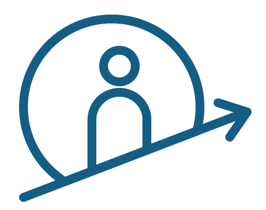

<p align="left" >
  
</p>

# SvelteKit Dapp template

This repository is meant to give [SvelteKit](https://kit.svelte.dev/) developers an easy on-ramp to get started with developing decentralized applications (Dapps in short) for the Internet Computer blockchain.

Svelte version:  4.2.9   
SvelteKit version: 2.5.0  
@dfinity/agent: 1.0.0   

## What is this repository for?
This repository is made for my personal use, but feel free to use it as a template for your own projects.

## Features
This templates includes two routes, a home page and a about page. The about page is a simple example of how to interact with the Internet Computer blockchain. It uses a simple store to store all queries.

It uses its own createActor function to create an actor for the Internet computer. This actor is implemented in the store and can therefore be used in all routes to interact with the Internet computer.

## Getting started
Make sure you have [node.js](https://nodejs.org/) installed. Node.js version 16 or later is required.

## Requirements: DFX + node.js

You can check your requirements by running the following commands in your terminal.

```bash
node --version
dfx --version
```

You can install DFX by running the following command in your terminal.
```bash
sh -ci "$(curl -fsSL https://internetcomputer.org/install.sh)"
```

### Fast Track
```bash
mkdir myapp && cd myapp

# terminal 1
dfx start --clean

# terminal 2
npx degit https://github.com/samlinux-development/ic-sveltekit.git
npm install

dfx deploy 
echo http://$(dfx canister id frontend).localhost:4943
```


### Start and stop the local replica

Open a new terminal window _in the project directory_, and run the following command to start the local replica. The replica will not start unless `dfx.json` exists in the current directory.

```bash
dfx start --clean --background
```

When you're done with development, or you're switching to a different dfx project, running

```bash
dfx stop
```

from the project directory will stop the local replica.

## Build & run the dapp

To build and deploy the project locally run

```bash
dfx deploy
```

When the process completes you'll have a frontend canister running locally. To find the frontend canister's ID, run

```bash
dfx canister id frontend
```

It will output something similar to `rno2w-sqaaa-aaaaa-aaacq-cai`. Copy this ID and open it in the browser using `http://<canister ID>.localhost:4943`, eg. `http://rno2w-sqaaa-aaaaa-aaacq-cai.localhost:4943`.

## Local development

You can serve the frontend in development mode like you normally develop an app using the command. But first, make sure your run **dfx deploy** to create the .env file and all decalarations.

```bash
npm run dev
```

## Deploying to the playground

To test your dApp under the Internet Computer's environment, you can deploy it to the [Motoko Playground](https://m7sm4-2iaaa-aaaab-qabra-cai.raw.ic0.app/).

```bash
dfx deploy --playground
```
